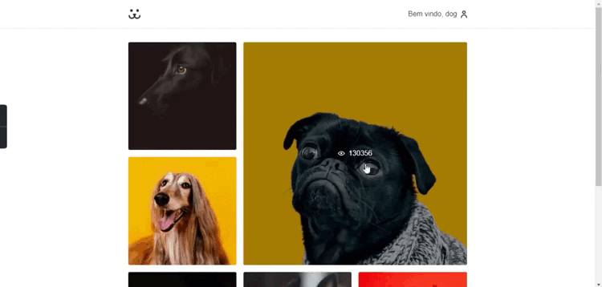
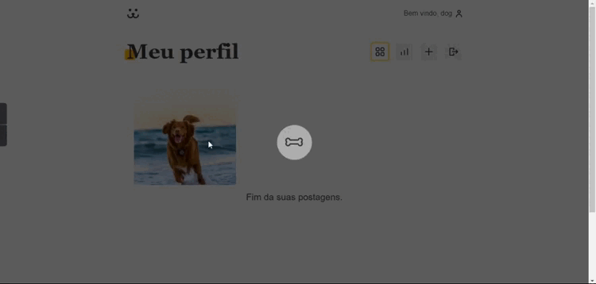
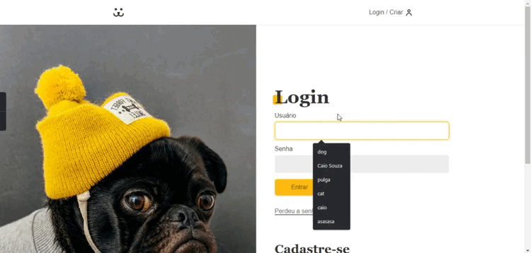
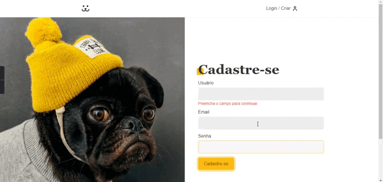

<h1 align="center">🐶 Dogs 🐶</h1>

Rede social para divulgação de cachorros.

 <a href="#sobre">Sobre</a> •
 <a href="#aprendizados">Aprendizados</a> •
 <a href="#paginas">Páginas</a> •
 <a href="#tecnologias">Tecnologias</a> •
 <a href="#instalacao">Instalação</a>

  <h1>📎 Sobre.</h1>
  
O sistema Dogs foi o primeiro contato com o framework React no curso da <a href="https://www.origamid.com/">Origamid</a>. Durante seu desenvolvimento, diversos conhecimentos vistos nas aulas e conceitos importantes de JavaScript foram aplicados. Além do framework, bibliotecas como Styled Components e React Router DOM foram utilizadas para auxiliar no desenvolvimento do projeto. <b>Para a utilização da biblioteca de estilo, foi feito um estudo à parte do curso baseado na documentação disponível no site dos criadores.</b>

  
O projeto conta com 10 rotas, 4 páginas com subrotas, cadastro e login de usuários, recuperação de senha, postagem e comentário de fotos, e uma estrutura de organização diferente da utilizada no curso.

  

    
  

 <h1>📚 Aprendizados. </h1>
 <ul>
  <li>Componentes, Propriedades, Contexto, Hooks, CustomHooks, JSX.</li>
  <li>Estrutura de pastas.</li>
  <li>Styled components.</li>
  <li>Rotas.</li>
  <li>Proteção de rotas</li>
  <li>Gitflow.</li>
 </ul>

  <h1>📄 Páginas.</h1>
  

    <h3>Home</h3>
    
    
A página Home é um feed de fotos de todos os usuários. Ela contém um componente de feed que apresenta um scroll infinito, que faz requisição de novas fotos quando o scroll acaba. Possui também o login automático, onde é verificado se há um token no localStorage. Se houver, é feito o login automático. Conceitos React utilizados: useState, useEffect, custom hook e context API.

  

  

    <h3>Perfil</h3>
    
    
O perfil do usuário também contém um componente de feed, entretanto, com suas próprias fotos. Na página, há outras sub-rotas, sendo elas:
      <ul>
        <li>O feed de fotos do usuário mencionado</li>
        <li>A estatística de acesso ao perfil e de cada foto, usando a biblioteca <a href="https://victory-graphics.co.uk/">Victory</a></li>
        <li>A postagem de foto, onde o usuário preenche um formulário com os dados da foto que deseja postar</li>
        <li>Vale ressaltar que essa é uma rota protegida, acessível somente após o login do usuário.</li>
      </ul>
    

  

  

    <h3>Login</h3>
    
    
A área de Login contém um formulário com um hook que valida os campos de acesso. Após o login, o token é salvo no localStorage para que o usuário não precise fazer login novamente manualmente.

  

  

    <h3>Cadastro</h3>
    
    
Para o Cadastro, no formulário é validado os dados preenchidos pelo usuário. Na API, no back-end, é verificado se já existe um usuário cadastrado com aquele email. Se existir, ou em outros casos de erro, tudo é tratado e exibido ao usuário.

  

  <h1>🛠 Tecnologias.</h1>
  

    
     
    
    
  

   <h1>ℹ️ Instalação.</h1>
  <ul>
    <li>
      
Clone o projeto e acesse a pasta do mesmo.

      <code> $ git clone https://github.com/souzzs/dogs.git </code>
    </li>
    <li>
      
Instale as dependências

      <code> $ npm install </code>
    </li>
    <li>
      
Inicie o projeto

      <code> $ npm start </code>
    </li>
  </ul>

  

  <h2 align="left">✏️ Autor.</h2>
  
  
  

